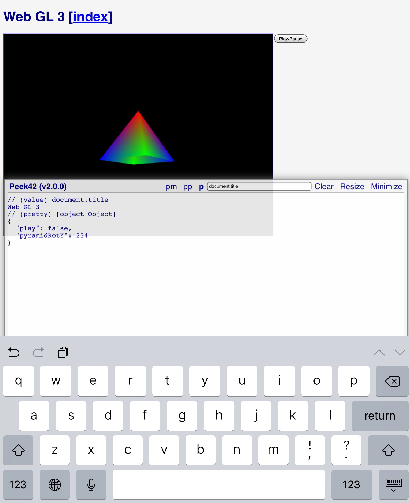

# Peek42

Lightweight browser console useful for quick prototyping on touch-based devices like tablets and smartphones



## [Demos](https://rpeev.github.io/peek42/)

## Install

### In a html page

Reference **monofur.css** (optional, counts on **monofur.woff** present alongside), **peek42.css**, [**apivis.js**](https://github.com/rpeev/apivis) (optional) and **peek42.js**:  

```html
<link rel="stylesheet" href="path/to/monofur.css" /> <!-- optional -->
<link rel="stylesheet" href="path/to/peek42.css" />
<script src="path/to/apivis.js"></script> <!-- optional -->
<script src="path/to/peek42.js"></script>
```

### Bookmarklet

Bookmark a webpage (any will do). Then change the title to your liking and the url to the following (set the *HOST_xxx* values to local paths in a locally hosted scenario):

```javascript
javascript: (function () {
  var HOST_APIVIS = 'https://cdn.rawgit.com/rpeev/apivis/v3.0.0/',
    HOST_PEEK = 'https://cdn.rawgit.com/rpeev/peek42/v4.1.0/',
    cssMonofur, cssPeek, jsApivis, jsPeek;

  if (!window.Peek42BM) {
    window.Peek42BM = true;

    cssMonofur = document.createElement('style');
    cssPeek = document.createElement('style');
    jsApivis = document.createElement('script');
    jsPeek = document.createElement('script');

    cssMonofur.innerHTML = '@import "' + HOST_PEEK + 'monofur.css' + '"';
    cssPeek.innerHTML = '@import "' + HOST_PEEK + 'peek42.css' + '"';
    jsApivis.setAttribute('src', HOST_APIVIS + 'apivis.js');
    jsPeek.setAttribute('src', HOST_PEEK + 'peek42.js');

    jsApivis.onload = function () {
      jsPeek.onload = function () {
        p([].slice.call(document.scripts).
          map(script => script.src).
          join('\n'), 'Environment');
      };

      document.body.appendChild(jsPeek);
    };

    document.body.appendChild(cssMonofur);
    document.body.appendChild(cssPeek);
    document.body.appendChild(jsApivis);
  }
})();
```

## Use

### In the code

**Peek42** makes two global functions available - `p(obj[, comment])` (stands for **print**) and `pp(obj[, comment])` (stands for **pretty print**).

The functions accept javascript object to dump and optional comment. **p** simply uses the object as part of string concatenation, **pp** uses `JSON.stringify` (with custom replacer function to avoid circular data exceptions). The comment is logged like a single-line js comment, on a line before the object. Default comment is generated if one is not provided. **Peek42** listens for JavaScript errors and uses **pp** to show them with the error message as a comment.

If [ApiVis](https://github.com/rpeev/apivis) is loaded, the `p.type(obj[, comment])`, `p.desc(obj, k[, comment])`, `p.members(obj[, comment])`, `p.chain(obj[, comment])` and `p.api(obj[, comment])` shorthands for the corresponding `apivis.xxxStr` functions are available.

**Peek42** intercepts the native console logging function calls, so **console.log** calls (for example) will show up.

`Peek42.noop()` can be called at the top of the script to prevent the console creation and silence the output functions.

### UI

If no log function has been called, **Peek42** is shown minimized. Click **Show** to show it. By default, whenever a log function is called, **Peek42** is shown and the log is scrolled to the top (entries are logged from oldest at the bottom to newest at the top), so that the latest logged object is visible. Click **Minimize** to minimize it. This can be changed by turning on the **Quiet** checkbox (visible only when **Peek42** is minimized). In this mode, **Peek42** flashes on log write, but stays minimized. **Peek42** is slightly transparent in an effort to minimize the need to be minimized.

Clicking the title (**Peek42**) works like this:

* if **Peek42** is scrolled to the top, then it gets scrolled to the bottom and vica versa;
* if **Peek42** is scrolled to the middle, then it gets scrolled to the top;

Use **Resize** to resize **Peek42** (**Peek42** limits its dimensions and the border briefly flashes upon reaching the limits) and **Clear** to clear the log contents.

Use the text box **JS to evaluate** to eval JavaScript code (write in the box and simply hit enter). Print functions can be specified by prefixing the expression with one of `v(alue)` (the default), `p(retty)`, `t(ype)`, `d(esc)` (requires two expressions separated by a comma), `m(embers)`, `c(hain)`, `a(pi)`. Only `v(alue)` and `p(retty)` are supported out of the box, the others require [ApiVis](https://github.com/rpeev/apivis).

See **peek42.html** for an example.
